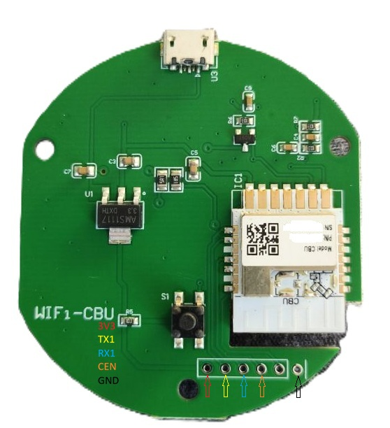
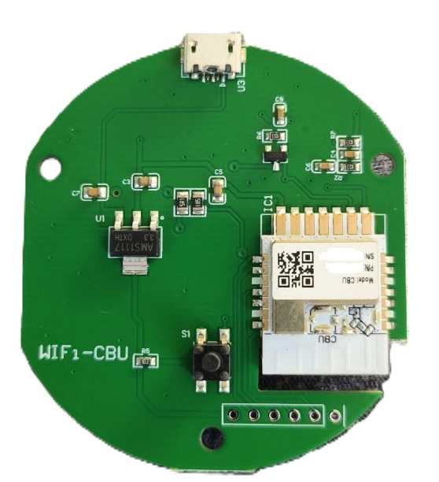

# 📡 Astrion IR Extender

A network-connected, transmit-only infrared blaster for
[Astrion Custom Dashboard](https://github.com/dckiller51/astrion-custom-dashboard).
Place one inside a closed cabinet, behind a TV, anywhere your remote's own
built-in IR blaster can't reach in a straight line — the app sends the
command over WiFi instead, and the extender fires the real IR signal from
whatever location you choose.

**Fully standalone.** No Home Assistant, no cloud, no account required. Generic
firmware, flashed once, works for every user — the app talks to it directly
over your local network.

> **Status:** hardware bring-up in progress. This README documents the
> firmware side; the "Devices" screen that discovers and registers
> extenders in the app itself hasn't shipped yet.

## Hardware Options

This project officially supports two low-cost hardware architectures:

1. **ESP8285 / ESP8266 Version:** Generic "Tasmota IR remote" modules commonly sold on AliExpress/Amazon.
2. **Beken BK7231N (CBU) Version:** Newer Tuya smart IR blasters utilizing the LibreTiny ecosystem.

## Flashing

### Option 1: ESP8285 Version (`.bin`) — Quick Web Install (Recommended)

1. Download the latest `astrion-ir-extender-esp8285.bin` from [Releases](https://github.com/dckiller51/astrion-ir-extender/releases).
2. Connect your ESP module to your computer via USB.
3. Open <https://web.esphome.io> in a WebSerial-compatible browser (Chrome or Edge).
4. Click **Connect**, select your serial port, choose to install from a local file, and select the `.bin` you downloaded.

### Option 2: BK7231N / CBU Version (`.uf2`) — Wired Serial UART

Because `web.esphome.io` does not natively support Beken chips yet, you must flash the LibreTiny image package using serial tools.

**Wiring:**

Open the device casing and solder (or clip) wires to `3V3`, `GND`, `RX1`, and `TX1` on the CBU module, then connect them to a USB-to-UART adapter (remember to cross RX/TX: module `TX1` → adapter `RX`, module `RX1` → adapter `TX`). Pin locations are on the underside of this specific module:





**Flashing with ltchiptool:**

1. Download `astrion-ir-extender-bk7231n.uf2` from [Releases](https://github.com/dckiller51/astrion-ir-extender/releases).
2. Get ltchiptool — on Windows, the standalone executable is the simplest route, no Python/pip needed: download `ltchiptool-vX.Y.Z.exe` from the [ltchiptool releases page](https://github.com/libretiny-eu/ltchiptool/releases) and run it directly. (Cross-platform alternative: `pip install ltchiptool`, then run `ltchiptool` for the same GUI, or use the CLI as below.)
3. CLI equivalent, if you prefer:

   ```bash
   ltchiptool flash write -d /dev/ttyUSB0 -b bk7231n astrion-ir-extender-bk7231n.uf2
   ```

   (On Windows, `/dev/ttyUSB0` is a `COMx` port instead — check Device Manager.)

4. Start the write in ltchiptool, then **briefly touch/bridge `CEN` to `GND`** right as it begins trying to connect — a quick momentary short, not a sustained connection — to drop the module into its UART bootloader. If it doesn't catch the bootloader window in time, retry the write and the CEN/GND touch together; it sometimes takes a couple of attempts to land the timing.

*Note: If your BK7231N device is already running an older version of LibreTiny firmware, you can skip the wires and upload the `.uf2` file directly via its existing OTA web dashboard interface.*

## Building from source (Modifying the YAML)

If you are changing the GPIO pinout or adding extra components, you must compile the firmware manually using Docker to output your own binaries.

**Option A — ESPHome Dashboard (Universal):**

Runs an interactive local server. Compiles inside the Docker container, while the actual USB flash step for ESP devices can happen through your browser via WebSerial.

```bash
docker run --rm -it -p 6052:6052 -v "\${PWD}/esphome:/config" esphome/esphome
```

1. Open <http://localhost:6052> in Chrome/Edge.
2. Both `astrion-ir-extender-esp8285.yaml` and `astrion-ir-extender-bk7231n.yaml` will be visible.
3. Click **Install** next to your chosen device configuration.

**Option B — CLI Compilation Only:**

```bash
# To compile for ESP8285:
docker run --rm -v "\${PWD}/esphome:/config" esphome/esphome compile astrion-ir-extender-esp8285.yaml

# To compile for Beken BK7231N:
docker run --rm -v "\${PWD}/esphome:/config" esphome/esphome compile astrion-ir-extender-bk7231n.yaml
```

* The ESP8285 build generates `firmware.bin` under `esphome/.esphome/build/astrion-ir-extender-esp8285/`.
* The Beken BK7231N build generates `firmware.uf2` under `esphome/.esphome/build/astrion-ir-extender-bk7231n/`.

## First boot — WiFi setup

The firmware ships with no network credentials baked in. On first boot (or if your local network becomes unreachable), the device creates a temporary provisioning hotspot:

1. Connect your phone or computer to the WiFi network named **`Astrion IR Extender Setup`**.
2. A captive portal page should open automatically. If it doesn't, navigate to <http://192.168.4.1>.
3. Enter your local WiFi SSID and password.
4. The extender will reboot and connect to your home network.

> **Multi-Unit Deployment:** ESPHome automatically appends a short, unique device MAC identifier to the hotspot name (e.g., `Astrion IR Extender Setup-a1b2c3`) if multiple units are powered on at the same time. This prevents naming collisions and lets you configure multiple devices simultaneously.

## API Integration & Testing

Once joined to your local network, the extender advertises itself over mDNS (`astrion-ir-extender-esp8285.local` or `astrion-ir-extender-bk7231n.local`) and exposes the following plain HTTP endpoints:

* `GET /text_sensor/<device_name>_mac_address` — Reads the MAC address (useful for manual registration apps if mDNS multicast is blocked across VLANs).
* `GET /text_sensor/<device_name>_ip_address` — Reads the local IP address.
* `POST /pronto` — Transmits a Pronto code out the IR LED. Send the raw code as the plain-text request body (`Content-Type: text/plain`), one request per command — no chunking, no length limit (this is a custom raw HTTP handler, not one of ESPHome's native `web_server`-exposed entities, specifically so it isn't bound by the 255-character cap those have).

```bash
curl -X POST "http://astrion-ir-extender-bk7231n.local/pronto" \
  -H "Content-Type: text/plain" \
  --data-raw "0000 006D 0022 0000 015A 00AE 0015 0016 ..."
```

A `200 OK` with body `OK - Pronto Code Received` confirms the extender accepted and queued the transmission.

*(No URL-encoding needed here — the code goes in the request body, not a query string.)*

## Factory reset

Press and hold the physical button on the module for 5 seconds. This completely erases all stored runtime configurations (including saved WiFi credentials) and drops the device back into captive-portal onboarding mode.

## Related projects

* [Astrion Custom Dashboard (Android app / APK)](https://github.com/dckiller51/astrion-custom-dashboard)
* [Astrion IR Sniffer (capture tool / IR database)](https://github.com/dckiller51/astrion-ir-sniffer)
* [HA Astrion Custom Dashboard (Home Assistant custom component)](https://github.com/dckiller51/ha-astrion-custom-dashboard)
